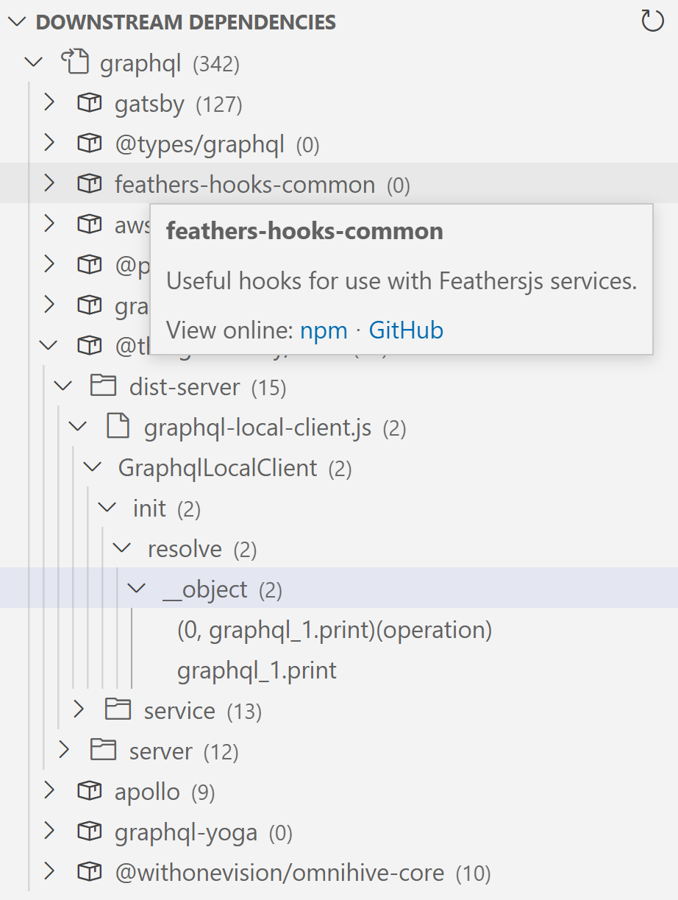
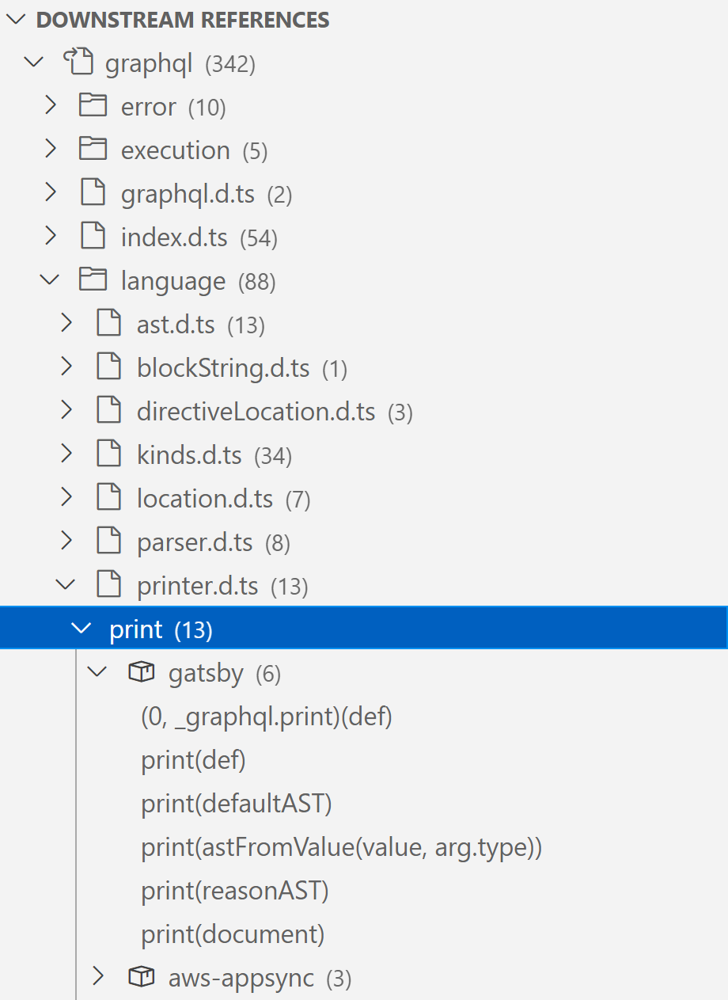
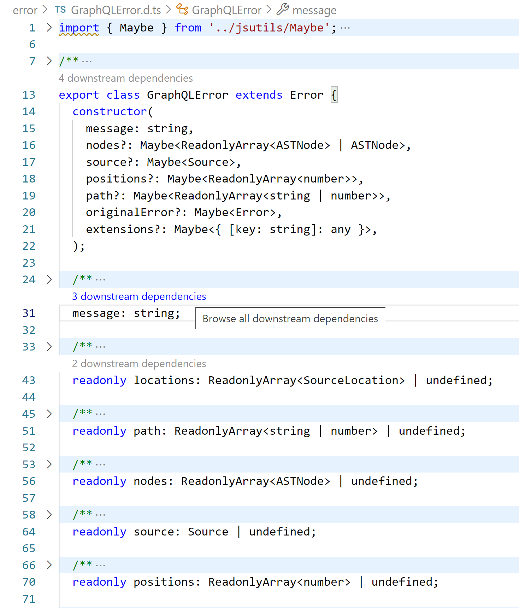

# dowdep

Mine usage information about your JavaScript/TypeScript package from dependent repositories and display them right in VS Code.

## Features

<table>
	<thead>
		<tr>
			<td>Survey downstream dependent projects</td>
			<td>Explore usage samples of package members from downstream dependencies</td>
			<td>CodeLens annotations for member references from downstream dependencies</td>
		</tr>
	</thead>
	<tbody>
		<tr>
			<td></td>
			<td></td>
			<td></td>
		</tr>
	</tbody>
</table>

## Configuration

After installing the extension, you need to fill in some access tokens.
To do so, navigate to the settings of the extension and enter each a valid token for the settings "githubOAuthToken" and "sourcegraphToken".

## Usage

After configuring the extension, open a folder in VS Code that contains a node module, i.e., a `package.json` file.
Open the downstream dependencies view from the activity bar (</img>) and press "Refresh downstream data" (you can also invoke this command via the command palette).
Dependencies are now searched, downloaded, analyzed, and displayed in the view.
Hover, click, or right-click any item to see additional details.

Also, make sure to check out all functionalities by searching for "Downstream Dependencies" in the command palette.
You can configure the extension in the settings by navigating to the Downstream Dependencies extension there.

## Development

See [Contributing](CONTRIBUTING.md).

## Credits

- Die icon ([`./assets/die-{dark,light}.svg`](./assets)) by Ben Davis from the Noun Project, edited.
